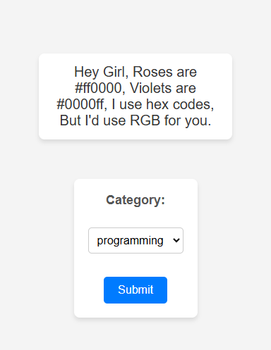

# Joke Generator

A simple web application built with **Express.js**, **Node.js**, **Axios**, **EJS**, and **CSS** that fetches and displays jokes from an external API. Users can select a category to receive jokes tailored to their preferences.

## Features

- Fetches a random joke from an external API.
- Allows users to select a category and get jokes from that category.
- Uses **EJS** for dynamic rendering of HTML.
- Styled with **CSS**.
- Uses **Axios** to make API requests.

## Technologies Used

- **Node.js**
- **Express.js**
- **EJS**
- **Axios**
- **CSS**



## Installation

1. Clone this repository:

2. Install dependencies:

   ```sh
   npm i
   ```

3. Run the application:

   ```sh
   node index.js
   ```

4. Open your browser and go to:
   ```
   http://localhost:3000
   ```

## API Used

This project fetches jokes from an external joke API. You can modify the API endpoint in the code to use a different joke source.

## Project Structure

```
├── public
│   ├── styles.css   # CSS styles
├── views
│   ├── index.ejs    # Main view
├── index.js         # Express server setup
├── package.json     # Project dependencies
└── README.md        # Project documentation
```

## Contributing

Feel free to contribute by submitting a pull request or opening an issue.

## License

This project is open-source and available under the [MIT License](LICENSE).
