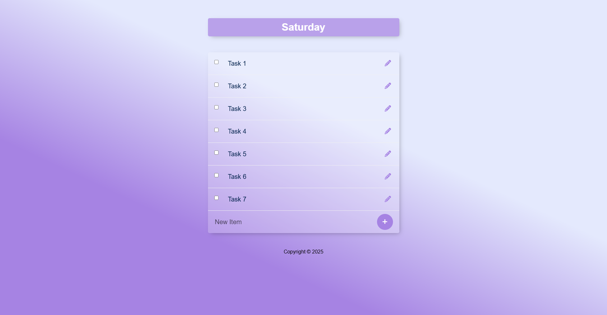
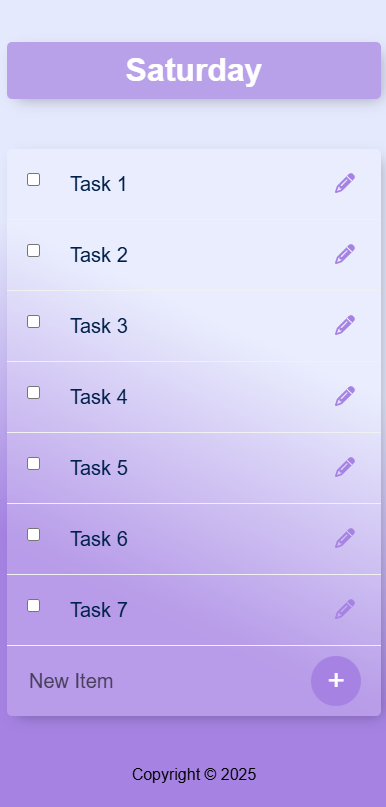

# Todo List Application

A simple and beautiful Todo List application built using **Node.js**, **Express.js**, **PostgreSQL**, **EJS**, and **body-parser**. This app allows users to add, edit, delete, and view tasks seamlessly.

## Screenshots




## Features

- Add new tasks
- Edit existing tasks
- Delete tasks
- View all tasks

## Technologies Used

- **Node.js** - JavaScript runtime
- **Express.js** - Web framework for Node.js
- **PostgreSQL** - Database for storing tasks
- **EJS** - Templating engine for rendering views
- **body-parser** - Middleware for parsing request bodies

## Installation

1. Clone the repository:
   ```sh
   cd Todo-list
   ```
2. Install dependencies:
   ```sh
   npm i
   ```
3. Set up the database in PostgreSQL (use **queries.sql** FILE) and update the connection details in the project.
4. Start the application:
   ```sh
   node index.js
   ```
5. Open your browser and go to `http://localhost:3300`

---

# برنامه لیست وظایف

یک برنامه زیبا و ساده برای مدیریت لیست وظایف ساخته شده با استفاده از **Node.js**، **Express.js**، **PostgreSQL**، **EJS** و **body-parser** که امکان اضافه کردن، ویرایش، حذف و مشاهده وظایف را فراهم می‌کند.

## ویژگی‌ها

- اضافه کردن وظایف جدید
- ویرایش وظایف موجود
- حذف وظایف
- مشاهده تمام وظایف

## تکنولوژی‌های استفاده شده

- **Node.js** - محیط اجرای جاوا اسکریپت
- **Express.js** - فریمورک وب برای Node.js
- **PostgreSQL** - پایگاه داده برای ذخیره وظایف
- **EJS** - موتور قالب برای نمایش صفحات
- **body-parser** - میان‌افزار برای پردازش درخواست‌ها

## نصب و راه‌اندازی

1. مخزن را کلون کنید:
   ```sh
   cd Todo-list
   ```
2. وابستگی‌ها را نصب کنید:
   ```sh
   npm i
   ```
3. پایگاه داده را در PostgreSQL راه‌اندازی کنید (با استفاده از فایل queries.sql) و اطلاعات اتصال را در پروژه تنظیم کنید.
4. برنامه را اجرا کنید:
   ```sh
   node index.js
   ```
5. مرورگر خود را باز کنید و به آدرس `http://localhost:3300` بروید.
