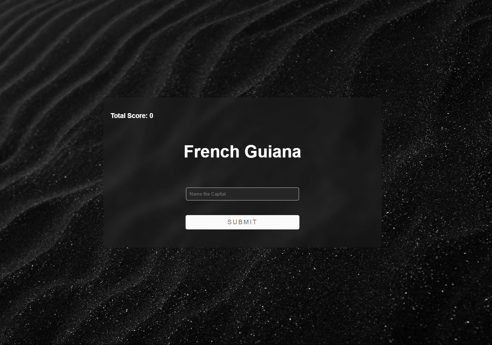

# Country Capitals Quiz

This is a simple Express.js application that quizzes users on country capitals. It fetches data from a PostgreSQL database and dynamically generates questions.



## Features

- Uses PostgreSQL as the database to store country and capital data.
- Supports user input and score tracking.
- Uses EJS as the templating engine.
- Styled with static files in the `public/` directory.
- Automatically selects random questions from the database.

## Installation

### Prerequisites

- Node.js (v14 or higher recommended)
- PostgreSQL installed and running

### Steps

1. Clone the repository:

   ```sh
   git clone
   cd Capitals-quiz
   ```

2. Install dependencies:

   ```sh
   npm i
   ```

3. Configure the PostgreSQL database:

   - Ensure PostgreSQL is running.
   - Create a database named `world`.
   - Update the database credentials in `index.js` if needed.
   - Run the following SQL command to create the `capitals` table:
     ```sql
     CREATE TABLE capitals (
         id SERIAL PRIMARY KEY,
         country VARCHAR(45),
         capital VARCHAR(45)
     );
     ```
   - Insert **capitals.csv** into capitals table

4. Start the application:

   ```sh
   npm index.js
   ```

5. Open your browser and go to:
   ```
   http://localhost:3000
   ```

## Usage

- The homepage presents a random country name, and the user has to enter the corresponding capital.
- After submitting an answer, the system checks whether it's correct and updates the score accordingly.
- The quiz continues with new random questions.

## Project Structure

```
project-root/
│── public/            # Static assets (CSS, images, etc.)
│── views/             # EJS templates
│── index.js           # Main server logic
│── package.json       # Project dependencies and scripts
│── README.md          # Documentation
```

## License

This project is licensed under the MIT License.
